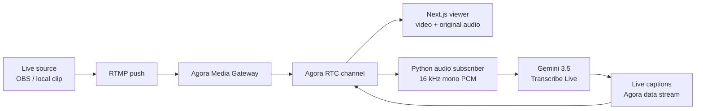

<div align="center">

# Agora MatchCast

**Real-time Gemini 3.5 Transcribe Live captions for Agora RTC streams.**

[](./LICENSE)
[](https://github.com/zicojiao/agora-matchcast/actions/workflows/ci.yml)


**English** · [简体中文](./README.zh-CN.md)

</div>

---

Agora MatchCast shows how to use **Gemini 3.5 Transcribe Live** for live-stream
captioning. An RTMP source enters Agora Media Gateway,
the stream is delivered to viewers through Agora RTC, and a Python subscriber
sends the incoming audio to Gemini in real time. The generated captions are
published back through an Agora RTC data stream and displayed over the video.

The goal is to explore a practical live speech-to-text pipeline for sports,
esports, and other fast-moving broadcasts. The demo uses a recorded League of
Legends match pushed as a live stream, so the whole flow behaves like a real
live broadcast while remaining easy to reproduce.

## Demo

This is Gemini 3.5 Transcribe Live captioning a chaotic League of Legends
broadcast through Agora RTC:

https://github.com/user-attachments/assets/b5218c04-f34d-43e5-b10f-7bb4335b834f

The model handled fast play-by-play commentary and picked up many
League-specific terms and player names.

The repository does not include match footage. Bring a local 16:9 clip or use
another authorized live source.

## Architecture



## Features

- Live RTMP ingest through Agora Media Gateway and Agora RTC playback.
- Gemini 3.5 Transcribe Live as the default real-time speech-to-text engine.
- Gemini `SMART` and `VERBATIM` transcription modes.
- CSV export with every caption update, the final transcript, selected model,
  and browser-observed latency milestones.

## Transcription Engines

| Selector | Model | Notes |
| --- | --- | --- |
| `gemini-transcribe` | `models/gemini-3.5-transcribe-live` | Default. Supports custom vocabulary and `SMART`/`VERBATIM` output. |

Configure a Gemini API key in the backend environment.

## Prerequisites

- Node.js 22 or newer and pnpm 9.
- Python 3.11 or newer.
- ffmpeg for pushing a local clip.
- An Agora project with an App ID, App Certificate, and Media Gateway enabled.
- A Gemini API key.

## Quick Start

### 1. Install dependencies

```bash
pnpm install

cd server
python -m venv .venv
source .venv/bin/activate
pip install -r requirements.txt -r requirements-dev.txt
cd ..
```

### 2. Configure the frontend

```bash
cp .env.example .env.local
```

Generate a secret shared only by the Next.js and Python services:

```bash
openssl rand -hex 32
```

Set at least these values in `.env.local`:

```bash
NEXT_PUBLIC_AGORA_APP_ID=<your-agora-app-id>
NEXT_AGORA_APP_CERTIFICATE=<your-agora-app-certificate>
NEXT_PUBLIC_LIVE_CHANNEL_NAME=matchcast-live
NEXT_PUBLIC_MATCH_FEED_UID=234567
AGENT_BACKEND_URL=http://localhost:8000
BACKEND_API_SECRET=<generated-shared-secret>

```

### 3. Configure the backend

```bash
cp server/.env.example server/.env.local
```

Set the Agora credentials, the same backend secret, and at least one provider
in `server/.env.local`:

```bash
AGORA_APP_ID=<your-agora-app-id>
AGORA_APP_CERTIFICATE=<your-agora-app-certificate>
MEDIA_UID=234567
BACKEND_API_SECRET=<same-generated-shared-secret>

GEMINI_API_KEY=<your-gemini-api-key>
GEMINI_TRANSCRIBE_MODEL=models/gemini-3.5-transcribe-live
GEMINI_LANGUAGE=en-US
GEMINI_TRANSCRIPTION_MODE=smart
```

`NEXT_AGORA_APP_CERTIFICATE` and `AGORA_APP_CERTIFICATE` hold the same Agora
certificate; the names differ because one is consumed by Next.js and the other
by the Python service.

### 4. Run both services

Backend terminal:

```bash
cd server
source .venv/bin/activate
uvicorn app.main:app --reload --host 127.0.0.1 --port 8000
```

Frontend terminal:

```bash
pnpm dev
```

Open [http://localhost:3000](http://localhost:3000).

## Push a Live Source

### Media Gateway Stream Key

Agora Media Gateway needs two RTMP values: a server domain name and a stream
key. The Console page enables Media Gateway, but it does not show a ready-made
stream key. When using Agora's unified RTMP domain, create the stream key with
the Media Gateway REST API.

For this project, generate the key for the default live feed:

```text
Channel: matchcast-live
UID: 234567
```

If you changed `NEXT_PUBLIC_LIVE_CHANNEL_NAME` or
`NEXT_PUBLIC_MATCH_FEED_UID`, use those values instead.

In [Agora Console](https://console.agora.io/):

1. Open **Projects** from the Console sidebar and select your project.
2. Enable **Media Gateway** from the project's feature list.
3. Open **Developer Toolkit → RESTful API** and create or copy a Customer ID
   and Customer Secret.
4. Add them to local `.env.local` only:

```bash
AGORA_CUSTOMER_ID=
AGORA_CUSTOMER_SECRET=
AGORA_MEDIA_GATEWAY_REGION=
```

Choose the Media Gateway region closest to your encoder or cloud RTMP source,
for example `eu`, `na`, `as`, `cn`, `jp`, or `in`.

Create the stream key:

```bash
pnpm run media-gateway:key
```

Copy the generated RTMP details into the source you want to use:

```text
RTMP server: rtmp://rtls-ingress-prod-<region>.agoramdn.com/live
Stream key: <generated stream key>
```

Keep the Customer Secret and stream key private. Do not commit them to GitHub
or put them in Vercel.

Agora's official documentation explains the unified RTMP server and the
stream-key REST API: [Media Gateway quickstart](https://docs.agora.io/en/media-gateway/get-started/quickstart)
and [Create streaming key](https://docs.agora.io/en/media-gateway/reference/rest-api/endpoints/streaming-key/create-streaming-key).

### Push a Local Clip

Push an authorized local clip through Agora Media Gateway:

```bash
RTMP_STREAM_KEY=<generated-key> \
RTMP_INPUT=/absolute/path/to/your-clip.mp4 \
STREAM_ONCE=1 \
pnpm run stream:sample
```

Omit `STREAM_ONCE=1` to loop the clip until you stop ffmpeg. OBS and other RTMP
encoders can publish to the same generated server and key.

## Gemini Configuration

Gemini receives mono 16-bit PCM at 16 kHz in 100 ms chunks. The dedicated
Transcribe Live adapter uses:

- `custom_vocabulary` for domain-specific names;
- flat `language_codes`, or an empty array when `GEMINI_LANGUAGE=auto`;
- `mode=SMART` by default, or `VERBATIM` for literal output.

Useful overrides:

```bash
GEMINI_TRANSCRIPTION_MODE=smart
GEMINI_VOCABULARY_MODE=custom
GEMINI_TRANSCRIBE_VOCABULARY=Faker,T1,Cloud9,Shockwave
GEMINI_TRANSCRIBE_ACTIVITY_MIN_MS=5000
GEMINI_TRANSCRIBE_ACTIVITY_MAX_MS=6000
GEMINI_TRANSCRIBE_ACTIVITY_HANDOFF_SECONDS=1.5
```

See [`server/.env.example`](./server/.env.example) for every tuning option.

## Deployment

The included configuration supports:

- Vercel for the Next.js frontend;
- Railway with [`server/Dockerfile`](./server/Dockerfile) for the Python
  backend.

Configure production environment variables on both services. Use the same
`BACKEND_API_SECRET`, point `AGENT_BACKEND_URL` at the deployed backend, and
keep every API key and Agora certificate server-side.

## License

[MIT](./LICENSE)
