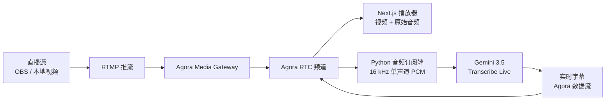

<div align="center">

# Agora MatchCast

**为体育与电竞直播生成实时 AI 字幕。**

[](./LICENSE)
[](https://github.com/zicojiao/agora-matchcast/actions/workflows/ci.yml)


[English](./README.md) · **简体中文**

</div>

---

Agora MatchCast 把直播音频转换成低延迟的实时字幕。RTMP 信号通过
Agora Media Gateway 进入 Agora RTC；浏览器播放直播，Python 订阅端接收独立
音频并发送到选定的转写模型；字幕再通过 Agora RTC 数据流返回浏览器，同时
显示在视频画面和右侧完整逐字稿中。

仓库不包含赛事视频。请使用你有权推流和分发的本地 16:9 视频或其他直播源。

## 架构



## 功能

- 通过 Agora Media Gateway 接入 RTMP，并使用 Agora RTC 播放直播。
- 默认使用 Gemini 3.5 Transcribe Live。
- 支持 Gemini `SMART` 和 `VERBATIM` 转写模式。
- CSV 导出包含每次字幕更新、最终逐字稿、所选模型和浏览器端延迟节点。

## 转写引擎

| 选择器 | 模型 | 说明 |
| --- | --- | --- |
| `gemini-transcribe` | `models/gemini-3.5-transcribe-live` | 默认选项。支持自定义词表和 `SMART`/`VERBATIM`。 |

在后端环境中配置 Gemini API key。

## 前置条件

- Node.js 22 或更高版本，以及 pnpm 9。
- Python 3.11 或更高版本。
- 使用本地视频推流时需要 ffmpeg。
- 已启用 Media Gateway 的 Agora 项目、App ID 和 App Certificate。
- Gemini API key。

## 快速开始

### 1. 安装依赖

```bash
pnpm install

cd server
python -m venv .venv
source .venv/bin/activate
pip install -r requirements.txt -r requirements-dev.txt
cd ..
```

### 2. 配置前端

```bash
cp .env.example .env.local
openssl rand -hex 32
```

把生成的随机值作为前后端共享 secret，并在 `.env.local` 中配置：

```bash
NEXT_PUBLIC_AGORA_APP_ID=<your-agora-app-id>
NEXT_AGORA_APP_CERTIFICATE=<your-agora-app-certificate>
NEXT_PUBLIC_LIVE_CHANNEL_NAME=matchcast-live
NEXT_PUBLIC_MATCH_FEED_UID=234567
AGENT_BACKEND_URL=http://localhost:8000
BACKEND_API_SECRET=<generated-shared-secret>

# 可选的本地或线上访问密码
```

### 3. 配置后端

```bash
cp server/.env.example server/.env.local
```

在 `server/.env.local` 中写入 Agora 凭证、相同的 backend secret 和至少一个
转写 provider：

```bash
AGORA_APP_ID=<your-agora-app-id>
AGORA_APP_CERTIFICATE=<your-agora-app-certificate>
MEDIA_UID=234567
BACKEND_API_SECRET=<same-generated-shared-secret>

GEMINI_API_KEY=<your-gemini-api-key>
GEMINI_TRANSCRIBE_MODEL=models/gemini-3.5-transcribe-live
GEMINI_LANGUAGE=en-US
GEMINI_TRANSCRIPTION_MODE=smart
```

`NEXT_AGORA_APP_CERTIFICATE` 与 `AGORA_APP_CERTIFICATE` 是同一个 Agora
证书，只是 Next.js 与 Python 服务使用的环境变量名称不同。

### 4. 启动服务

后端终端：

```bash
cd server
source .venv/bin/activate
uvicorn app.main:app --reload --host 127.0.0.1 --port 8000
```

前端终端：

```bash
pnpm dev
```

打开 [http://localhost:3000](http://localhost:3000)。

## 推送直播源

Agora Media Gateway 需要 RTMP server 和 stream key。在 Agora Console 中
启用 Media Gateway、创建 REST 凭证，并仅把下面的值写入 `.env.local`：

```bash
AGORA_CUSTOMER_ID=
AGORA_CUSTOMER_SECRET=
AGORA_MEDIA_GATEWAY_REGION=
```

为当前频道和 Media UID 创建 stream key：

```bash
pnpm run media-gateway:key
```

推送一次你有权使用的本地视频：

```bash
RTMP_STREAM_KEY=<generated-key> \
RTMP_INPUT=/absolute/path/to/your-clip.mp4 \
STREAM_ONCE=1 \
pnpm run stream:sample
```

去掉 `STREAM_ONCE=1` 会循环视频，直到手动停止 ffmpeg。OBS 和其他 RTMP
编码器也可以使用相同的 server 与 key。

## Gemini 配置

Gemini 接收 100 ms 一块的 16 kHz 单声道 16 位 PCM。Transcribe Live
适配器使用：

- `custom_vocabulary`：领域词汇和专有名词；
- 扁平的 `language_codes`，`GEMINI_LANGUAGE=auto` 时发送空数组；
- 默认 `mode=SMART`，需要逐字输出时使用 `VERBATIM`。

常用覆盖项：

```bash
GEMINI_TRANSCRIPTION_MODE=smart
GEMINI_VOCABULARY_MODE=custom
GEMINI_TRANSCRIBE_VOCABULARY=Faker,T1,Cloud9,Shockwave
GEMINI_TRANSCRIBE_ACTIVITY_MIN_MS=5000
GEMINI_TRANSCRIBE_ACTIVITY_MAX_MS=6000
GEMINI_TRANSCRIBE_ACTIVITY_HANDOFF_SECONDS=1.5
```

完整配置参见 [`server/.env.example`](./server/.env.example)。

## 部署

仓库内置以下部署配置：

- Vercel：Next.js 前端；
- Railway：通过 [`server/Dockerfile`](./server/Dockerfile) 部署 Python 后端。

在两个平台配置生产环境变量，使用同一个 `BACKEND_API_SECRET`，并让
`AGENT_BACKEND_URL` 指向线上后端。所有 API key 与 Agora Certificate 都必须
保留在服务端。

## 许可证

[MIT](./LICENSE)
